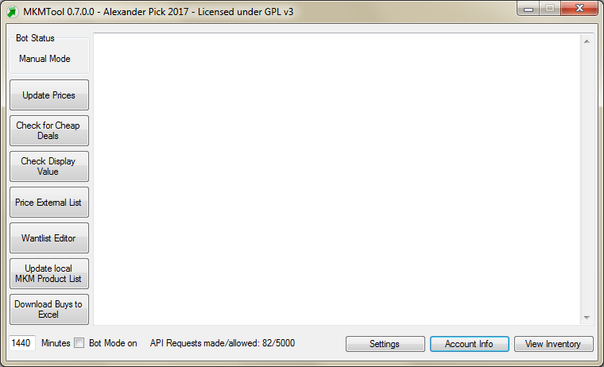
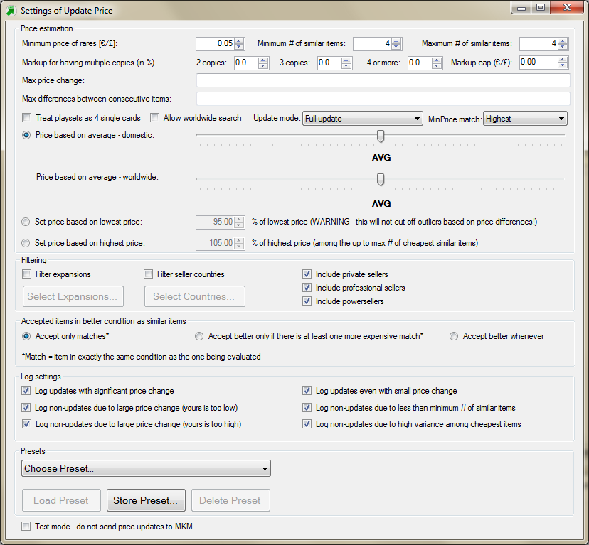
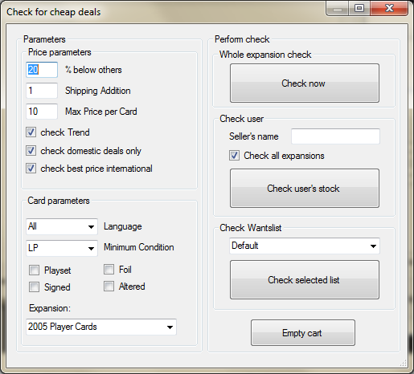
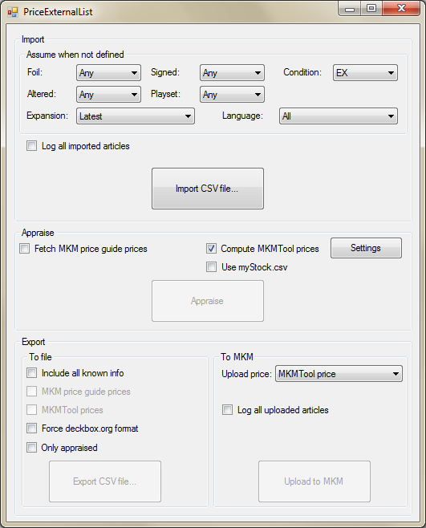

# Welcome to MKMTool 0.8

**IF YOU ARE UPDATING FROM A VERSION OLDER THAN: **
+ 1.12.2020: delete mkminventory.csv file in your bin folder before starting MKMTool (it will be recreated)
+ 0.8.0: do not just copy your config.xml - new variables were added to config_template.xml, keep them included in your new file. See [Installation and starting off](#Installation-and-starting-off) for details as well as the new [Settings](#Settings) documentation.

## Latest changes

**Version 0.8.2.1, 28.11.2023**
+ Fix price update failing when using ArticleCountFetched config setting of more than 100. Now still works with up to 1000, but each 100 costs 1 API call per cards -> default set to 100
+ Fix local cards database saved as corrupted file when closing MKMTool, so that local data had to be refreshed every run, using up a lot of request to fetch rarities and slowing appraisal
+ Fix foil cards being priced as non-foil
+ Fix foil cards from foil-only set not being updated

**Version 0.8.2.0, 30.3.2021**
Note: releasing on 29.9.2021, while API is still not fully functional. The new features were tested back in March on a professional account, it is unclear if and how they will work further on.
+ **Changed the meaning of minPrice in mystock.csv for playsets: ** before, the minPrice meant the price of the entire playset. Now, minPrice is always price of a single card, whether you sell it as a playset or not.
+ Added support for setting price by price guide, but only for commercial sellers (private sellers have access to necessary API requests blocked by Cardmarket - not MKMTool's fault). Price is specified as a simplified formula using numbers or any of the valid price guides as operands and multiplication, addition and subtraction as operators (no parenthesis). See documentation in the [Price Update](#Price-Update) section for details.
+ MinPrice in myStock.csv can be defined as a formula using price guides.
+ Added "PrescribedPrice" attribute for entries in myStock.csv. It can be specified as a formula (allows using price guides). If the "best matching template" (= most columns in myStock filled with non-empty values) has a PrescribedPrice, it will be used to set the price over any algorithm set in the Update Price settings GUI. It will still use markup for multiple copies and respect max price change limits and minPrice.
+ Rearranged Update Price Settings GUI to separate settings related to traversal of other seller's stock from other settings
+ When Update Price is running (not in bot mode) you can now stop it by pressing the update price button again. See [Price Update documentation](#Price-Update) for details.
+ You can now continue Price Update from where it ended last time if it did not process all your cards. Message box will ask you when pressing the Price Update button. See [Price Update documentation](#Price-Update) for details.

**Version 0.8.1.0, 22.2.2021**
+ In order to deal with recent drop in Cardmarket's API reliability, requests that time out either on MKMTool's or Cardmarket's side are now automatically repeated (after an additional 1.5s delay) up to a MaxTimeoutRepeat times (new parameter in config.xml, default is 4). You will still receive a "request timed out" error if all repeated attempts fail.
+ Fixed/Added support for other currencies than EUR. All prices will now be fetched in the currency of your account (this was supposed to work automatically according to communication from support, but they misinformed us). Small exception: in Download Buys, the price is in the currency the purchase was made.
+ Added an ArticleCountFetched config parameter, see documentation in the [Settings](#Settings) section. Relevant only if you are using only "expensive" countries and often get a "not enough similar items found"
+ Added Hong Kong among supported countries
+ Expansions database is now kept not just for M:tG, but for all the games you have allowed in your config.xml. Each is stored in its own file (ExpansionsDatabase\mkmexpansions_[gameID].csv), but when MKMTool works with them it concatenates those file into a single database. So modules like "check display value" will have all expansions of all your games in the expansions menu together. This can potentially lead to problems if two games have expansions with the same name, if you run into such problem, just temporarily comment out one of the games and do your work in two separate batches.
+ When using the MinPrice match "best match" method, cards that are rare or mythic now already count as already having matching template with one field (the "Minimum price of rares" settings). Previously, if you had a catch-all template in your myStock.csv file (i.e. only minPrice, no other fileds filled in), it would always take precedence to the "minimum price of rares", since it has 1 matching field (the min price). Now they both count as having one matching field, so the higher of them is chosen.
+ Fixed wordlwide search sometimes being performed even when turned off (when using the "accept better if there is at least one more expensive match" condition option) 
+ Fixed sorting in Stock View for numerical columns (price, count, idProduct) to be numerical, not alphabetical.

**Version 0.8.0.4, 22.1.2021**
+ Fixed crashes in Wantlist editor and Check cheap deals (System.NullReferenceException exception in function InitWantList, caused by recent changes in the API)
+ Fixed the drop down lists for expansions and wanlist names multiplicating their entries every time the window is opened
+ Fixed some rare errors when updating database

**Version 0.8.0.3, 13.1.2021**
+ Fixed crashes in View Inventory when some of the expected columns are not there.

**Version 0.8.0.2, 17.12.2020**
+ Fixed crashes when sellers country code is not recognized during price update.

**Version 0.8.0.1, 8.12.2020**
+ Fixed MKMTool crashing when it fails in fetching similar items, now it just goes to the next one.

**Version 0.8.0.0, 8.12.2020**

New/improved features:
+ MKM now limits the maximum number of API requests per minute to 600. MKMTool will now automatically wait before sending next request if the limit is reached.
+ All CSV lists used by MKMTool can now also use semicolon (the character ';') as a separator. MKMTool automatically detects if your file uses ';' or ','. ';' must NOT be contained in column names.
+ Added generic configuration settings for MKMTool that can be specified in the config.xml. Documentation is in the [Settings](#Settings) section.
+ Added setting to config.xml for choosing the CSV separator to use when exporting files (currently used in View Inventory, Price External List and Download Buys).
+ Fetching our own stock is now more efficient by using the GET STOCK FILE API request, which downloads the entire stock as a single CSV file, which MKMTool then parses. However, it does not include rarity, which we now have to cache it in the local database. See the UseStockGetFile documentation in [Settings](#Settings) for more details.
+ View Inventory now includes the idProduct. If UseStockGetFile is set to true, it will no longer include LocName, lastEdited and inShoppingCart columns. If you need those, you will have to switch UseStockGetFile to false (this will however significantly increase the time it takes to show the inventory).
+ Local Database now stores rarity for cards you appraised/updated (see the UseStockGetFile [Settings](#Settings) for more details). If the database is modified (some new rarity is noted), it is saved automatically to the file (mkminventory.csv) when you close MKMTool. You may notice ~2s delay when shutting MKMTool down in those cases.
+ Added "Filter expansions" to [Price Update](#Price-Update) / [Price External List](#Price-External-List): only cards from selected expansions will be processed.
+ Added "Filter seller countries" to [Price Update](#Price-Update) / [Price External List](#Price-External-List): when doing "worldwide search", only sellers from the selected countries will be taken into account. See documentation in the [Price Update](#Price-Update)section before using this feature.
+ Added filtering by user type - private, professional and commercial - to [Price Update](#Price-Update) / [Price External List](#Price-External-List): only articles by sellers of the selected types will be used for price update.
+ Added an "update mode" setting which allows you to control how is minPrice from myStock.csv used (among others, this allows you to bypass the price calculation algorithm and use myStock as a way to updated prices to whatever value you set in your CSV, as long as you are increasing prices).
+ Added an "MinPriceMatching" setting to [Price Update](#Price-Update) / [Price External List](#Price-External-List): controls if you use the highest of all minPrice in myStock.csv that match, or the one that matches the best, i.e. has the most filled-in columns.
+ Added setting to config.xml to fake your own country.
+ When updating price, the FirstEd parameter is taken into account when looking for similar items (relevant only for Yu-Gi-Oh).
+ The "Update local database" and "View Inventory" buttons switched places.

Bug-fixes:
+ MinPrice from mystock.csv was taken into account only if no price update was computed. Now it will always be checked even just against the current price.
+ Fixed crashes when Checking for Cheap Deals by wantlist when article in wantlist had "Any" as isFoil, isSigned or isAltered.
+ Fixed View Inventory using "S/T-Chinese" as language names instead of "Simplified/Traditional Chinese" (which are the only names recognized when importing a CSV)
+ Fixed price update/upload failing when comments include characters taking up multiple bytes in UTF (â, ¢ etc.)
+ Fixed the "Accept better only if there are more expensive matches" mode of "Accepted condition" setting to check if there are matching-condition articles even after the "Maximum number of similar items" was found. This fixes issues when for example you sell EX card, there is a lot of NM cards for low prices and then another EX above them - the EX above would not be found because too many better condition cards are cheaper and it would be evaluated as "no condition-matching item above found". In short, if you are using this mode, you MKMTool will succeed in computing a price more often.

<i>Show older changelogs</i>

**Version 0.7.0.5, 12.12.2019**
+ Fix Download buys outputting all the orders N times, where N was number of orders
+ Card and expansion name for singles in Download buys is now exported in English 

**Version 0.7.0.4, 19.10.2019**
+ Using the myStock.csv when pricing external list is now possible (there is a checkbox, default off). Also, if list contains the Min Price column, that price will also be used as minimal price (same rules apply as when using myStock.csv).
+ Fixed failed price updates when the price was computed to less than 0.02€ - MKM requires 2 cents as minimum -> if a lower price is computed, it is set to 0.02€
+ Fixed failed article updates when comments included characters that are special in XML (&, <, > etc.) -> the special characters can now be used
+ Language, Localized Name and Rarity have been added to the inventory viewer

**Version 0.7.0.3, 22.8.2019**
+ Fixed the "export only appraised" in Price External List to (hopefully) work correctly
+ In Price External List, when identifying cards based on their locName, full match is required now. Only products whose foreign name match exactly what is in the list will be considered as those cards. Before, many cards were falsely flagged as "multiple results for this card name", because of misc products like sleeves etc. with the same name as the card.
+ In Price External List, foreign name can now be any case (just as the English names)

**Version 0.7.0.2, 20.8.2019**
+ Fixed update price crashing when it encounters single cards from non-MTG games. Now they will be processed as well - but not all features are guaranteed to work for non-MTG.

**Version 0.7.0.1, 13.7.2019**
+ When reading a card from CSV and product ID, expansion ID or expansion name is not recognized, a warning will be displayed.
+ Some more clarifications on limitations of Price External List

**Version 0.7.0, 11.7.2019 (by [Tomas Janak](https://github.com/tomasjanak))**

Bug-fixes:
+ Fixed [Check Display Value](#Check-Display-Value) using locale-dependent number parsing, which caused the decimal delimiter to be ignored if you are using '.' instead of ',', leading to 100x higher prices.
+ Fixed numerous issues in [Check for Cheap Deals](#Check-for-Cheap-Deals), now it works as intended for all three modes (expansion check, user check, want list check)
+ Error logging is now more consistent, you can find all errors in the error_log.txt, separated for each individual run of MKMTool and with more precise description
+ Local database is updated after pressing the update button even when the files already exist on hard drive
+ Want list editor now also displays "metaproducts", that is cards for which you have set the expansion to "any" (it will show "\<any\>" in the expansion name column). In line with that, it will no longer crash if you open a want list that has only metaproducts.
+ Fixed behaviour of the delete function in Want List editor: when no line is selected, message is displayed; when multiple lines are selected, all of the selected items are deleted.
+ Fixed a minor bug in update price when using worldwide search: if the condition setting "Accept better only if there is at least one more expensive match" was turned on and it would cause not enough cards to be found among domestic items, the worldwide search would not happen, now it does.

New/improved features:
+ Added a new module "Price External List" - allows to generate new prices to a list of card loaded from a CSV file and then export it or directly put on sale to MKM. See [documentation](#Price-External-List) below.
+ The main window can now be enlarged
+ All "module" windows (Check Cheap Deals, Check Display Value etc.) now no longer block the main window, so you can scroll through the log while the module is opened. Clicking the module window while its window is open will close the window. Data that rely on your MKM profile are reloaded every time you re-open the window, but "local" settings (i.e. checkboxes you checked etc.) now persist when you close and re-open the window.
+ The number of API calls you sent to MKM is now displayed on the bottom of the window along the maximum number of calls you are allowed. When the limit is reached, MKMTool will no longer send any requests to MKM until you restart MKMTool or new day has passed (MKM resets the counter on 0:00 CET). The number of calls comes directly from MKM (they send it with each call), so it is 100% reliable. When you have only 50 calls remaining, the text will turn red to warn you.
+ Reworked GUI for [Check for Cheap Deals](#Check-for-Cheap-Deals). Also, for user check you can now filter only cards from the specified expansion rather than checking all cards of the user
+ Added the option to use different price factor for the average price when worldwide search is used for price update (there is a separate slider for it now)
+ Added the option to add markup on estimated price when you have multiple copies of a given card (see [documentation](#Price-Update) below)
+ Added the option to "ignore" the playset flag when updating prices - when turned on, all articles marked as playset will be treated as 4x single card
+ Separated "log non-updated if price change too large" log option into two - you can now select if you want to log these non-updates only when your price is higher or only when it is lower (also fixed it as the non-updates due to high variance was actually checked when this one should have been checked, so the this checkbox wasn't doing anything). Note that this is not backwards compatible with previous presets - when you load your own preset, you need to check the logging options you like and save it again.
+ Added the option to load a list of cards with minimal prices that the [Price Update](#Price-Update) module uses to not go below specified prices for any card you want (see details in the [documentation](#Price-Update) below)
+ Added the option to export your entire inventory to CSV file from the [View Inventory](#View-Inventory) screen.

**9.2.2019 (by [Tomas Janak](https://github.com/tomasjanak))**
+ Fixed "Bad Request 400" error when working with more than 100 items (partially by [Ramiro Aparicio](https://github.com/friscoMad)) after API changes announced on 6.2.2019
+ Mint condition is treated as Near Mint when looking for similar items
+ Added an option to search for similar items worldwide (ignoring your country) if there aren't enough similar items in your country
+ Fixed a bug causing in some cases the last added item to not be considered as matching condition even when it was
+ Comments are no longer removed from the article upon update
+ Added a "check for cheap deals from user" option

**27.01.2018 (by [Tomas Janak](https://github.com/tomasjanak))**
+ Added customizable settings for Update Price (see documentation below)
+ Price update no longer uses your own items when calculating the price
+ Richer log options

**11.07.2017**
+ Fixed weird bug which caused wrong price calculation on foreign systems
+ Fixed crash if articles other than singles are listed on the account

**24.04.2017**
+ Made GUI respond during article update
+ Error Log improved

**08.04.2017**
+ changed the default minutes for the bot

**23.02.2017**
+ country is no longer hard-coded and now determined at startup from your account details
+ code was cleaned up

**22.02.2017**
+ bug preventing the startup was fixed

## What is this?

MKMTool is a helper application I wrote for tinkering around with optimization of sale processes on magiccardmarket.eu and the idea of automation of some tasks most people wouldn’t be able to get done by pure manpower. 

This tool is intended for everyone who is curious about buying and selling MTG cards with more comfort. But needs some (minimum) technical skill at the current state.

First a small disclaimer and things to remember:

+ The entire tool uses the mkmapi 2.0 and is purely designed as proof of concept. If you use this application, always remember that this is coded for fun and not 100% perfectly tested. I am not responsible for any damage or anything it might cause. You are using it in a real environment where real loss of money is possible. Don’t blame me if you sell your lotus for pennies.
+ This is not an official MKM software product, it’s a private venture for the fun of it.
+ Non commercial users have 5000 API calls by day, depending on the function these can be exhausted very quickly (i.e. check for cheap deals, get box value). **BEWARE: MKM can block you from accessing the API if you repeatedly use large amount of requests that are not "stock management", even if you do not exhaust your request limit. Specifically, do not use [Check for Cheap Deals](#Check-for-Cheap-Deals), [Price External List](#Price-External-List) or [Check Display Value](#Check-Display-Value) too often / on large quantities of cards.** If that happens, you will still be able to use MKM, just not the API and therefore MKMTool. If it is your first offense, MKM will usually give you another chance after you talked it out with the support.
+ I am German, the code was written to sell Magic Cards. If you want to sell other things than MTG Singles you might need to adjust the code to your needs (Yugi, Pokemon or whatever games I don’t play should be easy, metaproducts might need more love). Note that the Update Price function will update prices of your cards from all games you have on Cardmarket, not just Magic - however, MKMTool was tested only on Magic cards, so some unexpected behaviour might occur.
+ Beware the program might be slow or if it is calculating it might be not responding a while. This is OK, I didn’t multithread it so this is no problem. Keep an eye on the main log window.
+ In the evening hours if magiccardmarket is crowded, the API seems to be slower, please take this into account if you use the tool.
+ If you find bugs, feel free to report them on github. 
+ This is GPL v3, free software written in C#.

## Installation and starting off

The preferred way is to compile MKMTool yourself, which is easier than it sounds. Download the code (green button in upper left corner on the main page) and unzip. Open MKMTool.sln in Microsoft Visual Studio Community 2015 or newer (free for private use, download URL see at the end of this file) and compile/run it, i.e. press the green Start button in top middle, or press F5 (see the discussion here for some common issues: https://github.com/alexander-pick/MKMTool/issues/33#issuecomment-621855056). 

If you do not want to do that, here is a build for Windows (64-bit):

https://github.com/tomasjanak/tomasjanak.github.io/blob/master/MKMTool0.8.2.1.zip, compiled by [Tomas Janak](https://github.com/tomasjanak)). **IF YOU ARE UPDATING FROM A VERSION OLDER THAN 1.12.2020, delete mkminventory.csv file in your bin folder before starting MKMTool. But from now on, try to always keep this file even as you update to new versions, it will store additional data about cards in your stock so that MKMTool can use less API requests and be faster.**

Before you can use the tool please rename config_template.xml to config.xml and add the apptoken details you can generate in your magiccardmarket profile: on the cardmarket website, click Account -> API Settings and generate tokens for "Dedicated App" (you can put anything you want as the app name). You need an account which is able to sell to use most of the seller functions. Once you generate it, four random strings of letters and numbers will appear there, copy-pasete those to your config.xml (see how-to run below for details).

**Short how-to run**

+ download the binaries
+ unzip everything to a folder
+ at MKM go to your account -> profile -> get a token for a dedicated (!) app
+ rename config_template.xml to config.xml
+ open config.xml with an editor and put the token details in the file. There are four values you need to enter: appToken, appSecret, accessToken and accessSecret. Enter the values from your MKM account instead of the ENTER_YOUR_xxxx_INSTEAD_OF_THIS_TEXT, where xxxx are the names of the values. 
+ run the tool - should work!

The first startup takes a bit since 3 MB of data is downloaded and unzipped, but there should be no problem on Win7 or 10 beyond this.

## Ok - ok, but what can MKMTool do?

MKMTool has several features/modules, click the links to bring you to documentation for the particular feature below:
+ [Price Update](#Price-Update): Automatically updates prices of your stock on MKM based on current prices similar cards are being sold for by other sellers. The algorithm used for computing the prices is highly customizable.
+ [Check for Cheap Deals](#Check-for-Cheap-Deals): Finds cards currently on sale on MKM that are significantly under-priced relative to the prices other copies of the same cards are on sale. There are three modes you can use: check cards from a specific expansion, from specific seller, or from your wantlist.
+ [Check Display Value](#Check-Display-Value): Evaluates the expected value you get from singles in a booster box of a specified set based on the current prices of singles on MKM.
+ [Price External List](#Price-External-List): Loads a list of cards from a CSV file and allows you to use the Price Update algorithm to set price to those cards and then export them back to CSV or put them directly on sale on MKM.
+ [Want List Editor](#Want-List-Editor): Adds or removes cards from any of your want lists.
+ [View Inventory](#View-Inventory): Downloads your entire stock from MKM and visualizes it in a table with a search function. Also allows you to export the inventory to a CSV file.

**Currency: MKMTool uses the currency of your account for all pricing and computation. Any numbers and settings you use that reference currency are in your account's currency.**

### Settings
But first, let's see settings you can choose in the config.xml file (values are entered without quotes):
+ **UseStockGetFile:** values can be "true" or "false", true by default. It is relevant for Price Update and View Inventory modules. It is a faster method of getting all of your stock in a single API request. The alternative uses 1 API request per 100 articles. However, it includes more information. Rarity is not included in the file version and is also not in the database downloadable from MKM. We have to now store it in our database as an additional column. Since obtaining it takes requests, it is done only when needed (i.e. you are updating a card for which you don't yet have rarity in your local database). When UseStockGetFile is set to false, it reads rarity and so it also updates it in the database for all articles that are being updated. If it is set to true, we have to do 1 request per each card with unknown rarity. Therefore, it is recommended to run price update once with UseStockGetFile set to false to get rarity for all cards in your current stock. Once that is done, you can switch to the more efficient UseStockGetFile = true. Newly added cards will use 1 additional requests, but that should be OK unless you are adding large batch of new cards (in that case you might want to do 1 run with UseStockGetFile set to false).
While it is irrelevant for Price Update, in View Inventory the following can be seen only when setting UseStockGetFile to false: LocName (name in the language of the card), inShoppingCart (true or false if the item is currently in shopping card) and lastEdited (time you last edited the article). Also, see Games setting below.
+ **Games:** if UseStockGetFile is set to true, we retrieve only cards of the specified games during price update/appraisal. The local database keeps all the products, but during processing (price updates etc.), we use only a subset of the database - only single cards from the games specified by this setting. This is because working with the whole database can take a long time, so keep the number of games you process to minimum for better performance. Keep the games you do not want commented (enclosed in <!-- -->), uncomment it to enable it. For example, config_template.xml has only Magic the Gathering uncommented and all other commented, i.e. MKMTool will work optimized for Magic the Gathering.
+ **CSVExportSeparator:** separator to use when exporting CSV files. Default comma (','), other reasonable choice is semicolon (';'). Note that this is only for export: for importing, the separator can only be comma or semicolon and it is detected automatically, it does not take this setting into account. So if you use something else than , or ; for exporting, you will not be able to open that file in MKMTool. Also, note that this will be used even if the export format requires other separator (for example, DeckBox.org requires comma, so even if you choose to export in Deckbox format in Price External List, Deckbox will not accept that file if you set something other than comma as CSVExportSeparator).
+ **MyCountryCode:** decides which country will be treated as your "domestic". Leave it empty to have it read from MKM (default). Use D for Germany, otherwise codes from here (but only for countries available on cardmarket): https://en.wikipedia.org/wiki/ISO_3166-1_alpha-2 
+ **ArticleCountFetched:** when getting cheapest articles of other sellers for a given card we are appraising (CARD in further text), MKMTool will send a request to cardmarket that says "give me ArticleCountFetched cheapest articles in the language of CARD, same or better condition as CARD, has the same foil, signed, altered, firstEd flags as CARD and are from the specifed user types (private, commercial, powerseller)". As you can see, it does not filter by country of the seller. If you use some restrictive country filter or you do not use worldwide search and there are not many cheap sellers in the countries you accept, it can happen that even first several hundreds of articles will not have any seller from your selected countries. You will then see a "not enough similar items found" message when updating/appraising cards (if you have log turned on). If that happens often in cases that seem like they should work, raise this number to up to 1000. However, it will lead to slower performance, so keep it as low as possible.
+ **MaxTimeoutRepeat:** if an API request fails due to a time out error or "service unavailable" error (which most of the time is due to time outs), it will be automatically attempted again until it succeeds or until it has been attempted a total of MaxTimeoutRepeat times. An error is logged only if all MaxTimeoutRepeat attempts fail. It is recommended to keep this number low (hence the default 4), the timeouts might happen due to legitimate reasons (e.g. servers down for maintenance) in which case MKMTool should just stop. Must be at least 1 (if lower number is entered, 1 is used).

### Price Update
This function will update all your card sale prices, all you need to do is press the Update Price button. The basic idea is to match your prices to the cheapest prices **from your country** (to avoid dealing with different shipping costs). However, there are numerous parameters that can change how exactly is this price computed, accessible through the "Settings" button on the bottom of the window - it is recommended to look at those first before your first run. The implemented algorithm will now be described, but if it is not good enough for you and you can write some C# code, you can modify the MKMBot class directly (look for MKMBot.UpdatePrices() method).

The base algorithm is called "TOSS" - Traversal of Other Seller's Stock. It is based on analyzing "similar items" being sold. This is a sequence of cards sold by **other** MKM users in **the same country as you** that are the same as the one you are trying to sell. "The same" means they have the same name, expansion, foil/nonfoil, signed/altered and playset/single statuses. Condition is always either the same or better and will be discussed later. Once the sequence is determined, the price is computed based either on the average or on the lowest or highest prices from the sequence. The sequence is always ordered from the cheapest items up. If the algorithm at some points finds out that it does not need another similar item, it stops reading them and just the ones found so far are used to compute the price. Hence the prices will always be a bit skewed towards the cheaper offers.

If you have a commercial account (professional or powerseller), you can also use price guides instead of / in combination with TOSS (the API does not provide the necessary request to non-commercial sellers, not MKMTool's fault).

 When Update Price is running (not in bot mode) you can stop it by pressing the update price button again. MKMTool will finish processing the current article (can take a few seconds if it is waiting on some API request) and then send to Cardmarket the articles that were already computed but not yet sent (normally MKMTool sends them in batches of 100).

MKMTool remembers the number of the last updated (sent to Cardmarket) article. If price update finishes prematurely (closing MKMTool or stopping price update), next time you run Price Update a message box will ask you if you want to continue from the last time or restart. Note that if your stock has changed significantly, some articles can be missed if you continue: MKMTool remembers simply how many articles were processed, not which ones.

The following figure shows the settings window. Each of the parameters will now be described in details, going from top to bottom, left to right:

#### General settings
+ **Minimum price of rares:** This is the minimum price that will ever be assigned to your rares (and mythics) no matter what price is computed.
+ **Markup for having multiple copies:** if you have more copies of a given card, you can increase the price a little - buyers who want multiple copies will be willing to pay extra when then safe on shipping compared to ordering the cards from multiple sellers one by one. After computing the price, MKMTool will add the specified percentage of the estimate on top of it. There are three levels of markup you can select - for 2 copies, 3 and for 4 or more. To avoid increasing the price way over what the potential buyers save on shipping, you can specify a cap. If the added amount would be more than this cap, only the cap value is added. 

	For example,  MKMTool computes a price of 5€ for a given card. You have 3 of them in stock and you set the markup for three copies to 10% and cap to 2€. The marked-up price will be 5.50€. Let's assume the same parameters are used, but now we have 3 cards for 50€. The 10% is 5€, which is above the cap, so the final price will be 52€.

	Note that there are several pitfalls: if you have the same card, but in different conditions or languages, these will not be counted as additional copies. If you have a card listed with the "Playset" tag, the 4-of markup will not be applied - but on the other hand, to estimate its price, only other "Playsets" on sale are used, so you should not need the markup. Lastly, this does not account for how many copies the other sellers have - we are basically assuming that all the N-cheapest prices are from sellers who have only 1 copy on sale. This will in most cases be true, but not always and as a result you might end up with higher prices than is competitive if there are many sellers selling multiple copies at low price. If you have suggestions on how this could be taken into account, leave a comment on the issues board.
+ **Max price change:** this allows you to set limits to how much can MKMTool change the prices of your cards. If the computed price is too much lower or higher than current price, it will not be sent to MKM. To account for different limits for different prices, this parameter is set as a sequence of pairs of numbers "T1;C1;T2;C2;T3;C3" etc. The first number in each pair, Tx, is a price threshold in €, the second number, Cx, is maximal allowed change in % of current price. For example, on the screenshot above you can see the following sequence: "1;200;5;25;10;15;50;10;100;5;999999;3;".
    
	This means: cards cheaper than 1€ can change by at most 200%, cards cheaper than 5€ by 25%, below 10€ by 15% etc. Let's say you have listed a card A for 0.5€ and card B for 11€. MKMTool will compute new price for card A as 1.4€. This is a 180% change, but that is ok, the price for this level can change by 200%, so anything between 0€ and 1.50€ for card A is good. For price B, it computes 9.35€, i.e. a 15% decrease. Original price is 11€, hence it belongs to the "50;10" pair, i.e. max allowed change 10%. This would be violated, so card B will remain at 11€.

+ **Update mode:** In the "Full update - TOSS" mode, the new price is computed using the "Traversal of Other Seller's Stock" and at the end, the calculated price is compared to the minPrice from myStock.csv. If the minPrice is higher, it is used as the new price instead of the calculated one. Also, if TOSS fails to compute a price (for example because of not enough similar items found), the minPrice will be compared to the current price and if it is below the minPrice, the new price will be set to minPrice. In the "TOSS only below minPrice" mode, TOSS will run only for items that have current price below minPrice. No updates will be done for other items. Lastly, in the "Only ensure minPrice", the price calculation algorithm is not used at all: items with current price below minPrice will be set to minPrice, no updates will be done for other items.
If you have a commercial account, a "Use Price Guides" mode will be available (cardmarket does not provide the necessary request to non-commercial sellers). In this mode, price guides are used instead of TOSS. Min price is checked the same way as with TOSS.
+ **MinPrice match:** controls how the matching with cards in myStock.csv (description below this list) is done. If it is set to "Highest", the minPrice will be set as the highest prices among all minPrices in myStock that match with the given card. If set to "Best", the minPrice that has the most details in myStock will be used, i.e. number of filled in columns. In case of a tie, the highest of the best ones is chosen. For example, let's say you have two rows in myStock.csv, one with Lightning Bolt as name, minPrice 1 and everything else empty and second one with Lightning Bolt as name, minPrice 0.5 and Expansion "Fifth Edition". If you set MinPrice match to "Highest", all your Lightning Bolts will use minPrice of 1, even the ones from Fifth Edition. If you set it to "Best", Bolts from Fifth Edition will count with minPrice 0.5: even though it is lower, they matched with a more detailed entry and that entry will be used above all.

#### TOSS settings
+ **Minimum # of similar items:** if by the end the sequence of similar items is smaller than this number, no price update will be performed.
+ **Maximum # of similar items:** once the sequence of similar items has this many items, the algorithm will stop adding new ones and will move on to computing the price. Since the sequence is built from cheapest to most expensive items, the larger this number is, the higher the computed price will potentially be as more expensive items will be included. However, it also limits the possibility of the price being too low due to some outliers.
+ **Max difference between consecutive items:** this is a main tool for culling away prices that are outliers. It is recommended to always use this in order to get prices that are agreed upon by majority of sellers and hence are most likely to be describing the real value of the card. The formating is the same as for "Max price change", i.e. sequence of "Tx;Cx" pairs, where Tx is again a threshold, but this time it is a threshold for price of a reference card - such that is already part of the sequence of similar items. Cx is maximal allowed difference (in percent of the price of the reference item) between that item and a next item that should potentially be added to the sequence. 
    
	This is applied in two steps. First, when minimum # of items is reached, the limits are used to cull away outliers on both sides of the sequence, i.e. including suspiciously cheap items: median (item in the middle) of the sequence is chosen as reference and the tool looks at the more expensive item. If it passes the check (it's price is at most [(reference price) + (reference price * Cx/100)]), it is taken as the next reference for the next item etc. If some item is culled, the algorithm ends - it is clear that a sequence of at least min # of items cannot be created and new price cannot be set, because the variance of prices is too large. If none is culled, then starting again from the median, the cheaper items are checked in the same way - this time culling away the too cheap outliers. Then the tool will continue with finiding next similar items. Note that this is done only once - even if some items were culled from the bottom, it is assumed that, for the purpose of outliers culling, the minimum amount of similar items has already been found. For this reason it is recommended to use reasonably large amount of min # of similar items (3 should be absolute minimum) - if you don’t have that, very cheap items will not be culled away.
    
	If the minimum # of items has been found, subsequent items are added only if they pass the difference check, with the last added item being the reference. Once an item that does not pass the test is found (or when maximum # of similar items is found), the algorithm will end and moves on to computing the price.
+ **Treat playsets as 4 singles cards:** when checked, each article marked as "Playset" (both yours and other seller's cards) is treated as if it was 4 separate cards. Your cards will still be updated with the flag, but for the purpose of analyzing prices, the flag is ignored (of course, the price per unit is used when using playset articles). This also means that the highest markup will be used. Playsets in general don't appear very often, so this way you can make sure that the prices for your playset items will stay up to date. However, unless you use high markup, you will usually end up with lower price.
+ **Allow worldwide search:** when checked and the minimum # of similar items is not found among seller's from your country, the items are processed again, this time ignoring the country of the seller. This is done only if there is not enough similar items without any culling - if the minimum is not reached because of culling, this will not be done. This option ensures that your prices are updated even for items that nobody in your country sells - typically rare cards like foreign foils etc. You can set a different (recommended higher) factor for the price average using the separate slider.
+ **Set price based on average:** when this is selected, the price will be computed as an average of prices of the similar items. You can also move the slider to go slightly above or below the average, with up to lowest or highest price among the sequence of similar items. The values in-between are computed by a linear interpolation between either the lowest price and average (for the lower half) or average and the highest price.    
	Example: the sequence has only four items, priced as: 10 12 14 19 €. Average is 13.75€. If you move the slider to half-way between lowest price and average, the price will be set as (Lowest Price + 0.5 * (Average - Lowest Price)), which is 11.875€. On the other side, if you move it half-way between average and highest price, it will be (Average + 0.5 * (Highest Price - Average)), which is 16.375€. Notice the difference is much larger for the second case - that's because the 19€ is quite far away from the other values and in fact should probably be culled away as an outlier (see above).
+ **Set price based on lowest price:** just takes the lowest price and sets new price as a given percentage of it. This is useful if you want to quickly get rid of all your cards, you can ensure that your price will always be lowest by e.g. setting all your cards to 97% of lowest price. However, note that this will not collect the similar items as usual and therefore will not do any culling of outliers. So if somebody for example by mistake lists a card and forgets one '0', you will also end up with unreasonably low price for your card. For this reason, MKMTool will require to set up some "Max price change" limits if you are using this mode. Of course, you can just set some very gracious limits, but don't say we didn't warn you.
+ **Set price based on highest price:** collects the sequence as usual, but instead of computing average, takes the given percentage of the highest price among the sequence and sets it as new price. Useful if you...don't want to sell your cards at all?
+ **Filter expansions:** when turned on, only cards from selected expansions will be processed when doing the price update. Press the "Select Expansions..." button to open a pop-up window to select the expansions. By clicking you always select only one expansion, hold CTRL to select multiple. Deselect by holding CTRL and clicking on selected. You can also press and drag the mouse to select multiple consecutive expansions while holding CTRL. Holding SHIFT and clicking will select everything between the last selected expansion and the one you clicked. Pressing a letter key will bring you to the first expansion starting by this letter, pressing it again will move to the next one starting by this letter. However, it will also erase your current selection unless you hold SHIFT (but that will select all expansions between the searched one and the last selected).
+ **Filter seller countries:** can be used only in conjunction with "Allow worldwide search" (see above). When turned on, during the worldwide search, only sellers from the specified countries will be used for determining the price. WARNING: if you want sellers from your country to be taken into account and you are using this filter, you MUST include your own country in the filter as well (but sellers from your country will still be used during the domestic search even if your country is not in the filter list). Countries are set the same way as in "filter expansions" (see above) using the "Select Countries..." button.
+ **Include X sellers:** ...where X is private, professional or powerseller. Only articles by sellers of the selected types will be used for determining prices.
Note (this will be inconsequential for most users, but let's clarify it): MKMTool can ask cardmarket to get list articles based on user type as such: private only, professional + powerseller (no private), or powerseller only. So if you choose for example "include private + powerseller", we still have to get articles by all sellers (since we want to do only 1 API request) and then remove the professional sellers from it on our side. So it is most efficient to use either privates only, or powersellers only, or powersellers + professional - that way the filtering is already done on cardmarket's side.
We are always getting 150 cheapest articles to use for the price estimation, so it will usually work fine anyway. For example, you select "include only powersellers and privates", we have to get 150 cheapest articles by everyone. Let's say 80 of those are by privates, 50 by professionals and 20 by powersellers -> only 100 articles will actually be used for the price estimation, but that will usually be enough unless you have some very high numbers set as "minimal # of similar items". However, in case of some weird anomaly, let's assume 145 of the cheapest articles are by professional sellers. You are then left with only 5 articles to use for the estimation. Similarly if you are selecting "private + professional" or "professional only", we have to deal with powersellers as well (but they are unlikely to make a significant portion of the lowest 150).
+ **Accepted condition:** as mentioned before, MKMTool will always look only at cards that are in the same or better condition as the one you are trying to sell. However, you can control how to treat the better ones. First option is to disregard them completely - only matching condition cards will be used. But this way you can often end up with not enough similar cards. Other extreme option is to not look at the condition at all and go just by the price (right-most option). However, if you are for example selling a damaged card for low price and everybody else has only mint version of this card, the computed price will end up much higher that it should be.
    
	A compromise, and probably the best option, is "Accept better only if there are more expensive matches". Cards in better condition will be accepted as part of the sequence, but only if there is some card with exactly matching condition above (more expensive) than the ones in better condition. In the end, all cards until the last exactly matching (or "Maximum # of similar items", whichever comes first) will be used to compute the price, the remainder of the sequence will be thrown away. This will still not help if nobody is selling cards in similar condition. But in the more usual cases where NM and EXC cards tend to have similar prices, they will be treated as equals and accounted for.

#### Price guide settings
+ Non-foils/Foils price guides: when using update by price guides, the price is defined as a [formula](#Price-as-formula), one for foils and one for non-foils. The formula starts with one price guide and can be followed with additional modifiers written in the textbox in the format described in the [formula documentation](#Price-as-formula). The codes for price guides used in the modifiers are the same as in the drop-down lists for foil/non-foil price, here is their explanation (copy pasted from https://api.cardmarket.com/ws/documentation/API_2.0:PriceGuide; also available as a tooltip when you hover mouse over the drop-down lists):
  + SELL: The average sell price as shown in the chart at the website for non-foils
  + LOW: The lowest price at the market for non-foils
  + TREND: The trend price as shown at the website (and in the chart) for non-foils
  + LOWGERMAN: The lowest sell price from German professional sellers
  + SUGGESTED: A suggested sell price for professional users, determined by an internal algorithm; this algorithm will not be made public
  + SELLFOIL: The average sell price as shown in the chart at the website for foils
  + LOWFOIL: The lowest price at the market as shown at the website(for condition EX+) for foils
  + TRENDFOIL: The trend price as shown at the website(and in the chart) for foils
  + LOWEX+: The lowest price at the market for non-foils with condition EX or better
  + AVG1: The average sale price over the last day
  + AVG7: The average sale price over the last 7 days
  + AVG30: The average sale price over the last 30 days
  + AVG1FOIL: The average sale price over the last day for foils
  + AVG7FOIL: The average sale price over the last 7 days for foils
  + AVG30FOIL: The average sale price over the last 30 days for foils
  + CURRENT: Not really a price guide, this is your current price of the card

+ Use TOSS when price guide not found: In some cases, particular price guides might not be available for a given card (e.g. for cards that do not sell often, data might not be available). If this checkbox is checked, TOSS will be used as a failsafe in this case.
+ Write to log when price guide not found: Whether to log the failure or not to find the guides.

#### Log settings
+ **Log updates with significant price change:** when checked, information containing old and new price will be printed in the log for each successfully updated card. However, the "Minimum price of rares" will be used to determine if you consider the price change significant - when a new price for some item is computed, it is compared to the old price. If the difference is not smaller or higher by the minimum rare price (or more), it will be considered insignificant. This is done so that less items are listed in the output log, so you can easily check only the important changes that were made.
+ **Log updates due to minimal price change:** if the price changed only little, it will not be updated (see "Log updates with significant price change" above). If you want to be notified about such items anyway, check this box.
+ **Log non-updates due to less than minimum # of similar items:** this is tied to the "Minimum # of similar items" parameter. It can be helpful when you are tuning your parameters, mainly the "max allowed difference", to see if you are not culling items away too aggressively.
+ **Log non-updates due to large price change:** this is tied to the "Max price change"  parameter. It is recommended to always leave it turned on - you will be notified about items that spiked in price. However, if you are not updating your prices regularly or you don't have the time to check the log all the time, you might want to simply open up your "max price change" limits. There are also separate checkboxes for when your price is too high and for when it is too low. For example, if you do not care too much if your articles are overpriced, but you want to make sure you don't miss if some price went up, you can check the "yours is too low" version and keep the "yours is too high" unchecked.
+ **Log non-updates due to high variance:** this is tied to the "Max difference between consecutive items" parameter, specifically to it's first application to the initial part of the sequence of similar items: if the sequence collection had to be abandoned because outliers were culled away early, you will be notified about them if this is turned on.

#### Misc settings
+ **Presets:** since tuning all the parameter can be time consuming, the Preset mechanism allows you to save them once you are happy with them and then re-use them later. Presets are stored in the "Preset" folder as .xml files and contain values for all the settings you can make in MKMTool + a brief description of what the author of the preset wanted to achieve. If you create some interesting preset, you can easily share it with others by simply sending them the xml file (there is a separate file for each preset) and placing it in the "Preset" folder (the app needs to be restarted to load the newly added files). 
    
	When you select a preset in the combo box, you will only be shown its description on the right side. If it sounds good, you can load it by clicking the "Load Preset" button - all the setting parameters will be set to values specified in the preset. Note that there is no undo button, so store your settings first if you want to keep them. You can do that by clicking the "Store Preset..." button. It will open a dialog where you choose the name and description of the preset and then it will store your current settings. You can also delete settings, which will also delete the associated .xml file, so do it only if you are completely sure you want to get rid of it.
    
	The application remembers the last preset you used and automatically loads it when you start it.
+ **Test mode:** if you check this, the computed prices will not be sent to MKM, they will merely be computed and logged for you to check. This is very useful when you are tuning the parameters or when you want to be very careful - you can run first in test mode, see what changes would happen and then, if there is no problem, run it in regular mode.

There is also a Bot mode, you can make the tool execute this task every X minutes. The preset is 360 minutes = 6 hours. Keep your API Limit in mind, the tool needs to request the product data for every article you own to calculate the price, 1 call per item is needed. 

You must feel comfortable with the formula or change it to your demands, be aware that making mistakes in price calculation can cost you real money. Handle with care.

#### MyStock
You can also define a list of minimum prices for which you want to be selling certain cards. For those cards, the Price Update will not give them lower then specified price no matter what the algorithm computes. This can be useful if you for example want to make sure you are not selling certain cards for less than you bought them for, or if you have certain cards you don't really want to sell unless for a high enough price. The list is defined as follows:

Create a CSV (comma separated values) file in the same folder as your binary is, i.e. alongside your config file, called "myStock.csv" (case sensitive). See [CSV card lists in MKMTool](#CSV-Card-Lists-in-MKMTool) for details about format. You do not need to do anything else to turn the feature on - if the file is present, it will be used (you will also see a message in the log window that the list has been found), if not, the update will still be done without it. After MKMTool computes the price for a particular article, it checks if there is an entry in myStock.csv that matches all attributes of that card and if so, the computed price is compared with the MinPrice in the list and if it is lower, the MinPrice is assigned to the item instead. **You do not have to use all the attributes.** In fact, for the purpose of price update, the only required attribute is the MinPrice itself (if a row in the list does not have it filled, it will be ignored), everything else is optional. When a certain attribute is not filled in for a particular card in the list, it is assumed that you do not care about its value and therefore any article will be considered a match according to that particular attribute. Therefore, each entry in the list does not need to represent a particular card, it can be just sort of a template for a card, a "metacard". In the extreme case, you can have just the MinPrice and nothing else. Such metacard will always match with any card so you can use such metacard to set a minimum price for any card in your stock. Note - MKMTool "groups" (hashes) the metacards by the card name, so only metacards that have a matching name are actually tested for a the card that is being updated + all metacards that have no name assigned. So you don't have to be worried that adding a lot of articles in the list would significantly slow MKMTool down.
Note: there is a setting that allows you to match with only the most detailed entries in the list, see [Price Update](#Price-Update), setting "MinPrice Match". The following example assumes it is set to "Highest" (default).

For example, assume your myStock.csv looks like this:

| Name  | Expansion | Condition | Foil | MinCondition | MinPrice | 
| ----- | --------- | --------- | ---- | ------------ | -------- |
| Lightning Bolt | | | false | GD | 2 |
| Lightning Bolt | Beta | | | | 200 |
| Lightning Bolt | Magic 2011 | NM | true | | 10 |
| | Beta | | | | 20 |

What does this say? It says you have a lot of Lightning Bolts on sale, you don't want to sell them for less than 2€ unless they are in a less then Good condition, you also have some from Beta, which are much more expensive and also one (or maybe more) foil from M11. Additionally, you have a bunch of other Beta cards and while you didn't want to bother writing all of them down, you are sure that even the worst Beta card is worth at least 20€. Now let's see what happens when you start updating the price of your cards. 

First, let's say we are updating price for Jace, the Mind Sculptor from Worldwake. Our first three metacards are for Lightning Bolt, so that does not match. For the fourth rule, the name matches (because we do not care about it), but the second attribute is Beta and that does not match Worldwake, so we have no matching metacard for our Jace and his price will be assigned without any safety net. 

Next let's say we have a near mint Lightning Bolt from M11. MKMTool computes 1.8€ for it and we go to metacard matching. For the first one, it matches the name, it is not foil and the condition is better than GD - so we have a match for everything. We compare the minimal price and see that it is higher than the computed price, so for now we set the price to 2€, but we still have to compare all the other metacards. The next one have a matching name, but not Expansion, so that's a pass. The next matches in name, expansion and condition, but not the Foil attribute, so it will also not be used. Lastly, the last metacard will not match by expansion. We will put our Bolt on sale for 2€.

Next article we have is a Lightly Played Lightning Bolt from Beta. MKMTool computed 186€ as its price. The first metacard will not be matched, because the condition is not good enough, but the next one will be - the Name matches, the Expansion matches and there is nothing else to check. The minimum price is higher, so we bump up the price to 200€. The third metacard does not match by many attributes, but the last one does as the only attribute is Expansion and it is Beta. However, 20 is less then 200 so after comparing the prices we will keep our 200€ price tag and that is what we upload on MKM in the end.

You can also define a PrescribedPrice column. If the best matching template for the appraised card has a PrescribedPrice, it will be used over the TOSS or Price Guide algorithm. The markup for multiple copies will still be applied and the max price change and MinPrice will be respected.
Only the best matching template is used. For example, if there are two matching templates for a given card and only one has a Prescribed Price, it needs to have a total number of filled in columns higher than the other template. If it does not, Prescribed Price will not be used since the best matching template does not have it. Note that the prescribed price itself counts when computing the number of filled-in columns.

#### Price as formula
Both the MinPrice and PrescribedPrice can be defined as a formula comprising of any number of operands separated by operators. The operands must be either numbers or [price guide codes](#Price-guide-settings). The operators can be only `*` for multiplication, `+` for addition or `-` for subtraction. Parenthesis are not supported. Because of that, the operations are evaluated in the order written, they do not respect common arithmetic rules. I.e. `TREND+0.5*1.2` for a card with TREND value 10€ will evaluate to (10+0.5)*1.2 = 12.6€ (not 10+(0.5*1.2)=10.6€ as you would normally expect). This somewhat limits how they can be used, but you can still do for example `TREND+AVG7*0.5` to compute the average of TREND and 7 day average.

### Check for Cheap Deals

For the fun of it – with this feature you can find cheap deals with X percent cheaper (the first parameter, see figure above) than other vendors and cheaper than the Trend if selected. You can specify a shipping addition to be added to the lowest found price to ensure a good deal. If cards are found they are directly added to your cart on MKM, just log in and check your cart. Use the parameters on the right side of the window to specify what kind of cards you are looking for and how it should be priced. There are three ways to check cheap deals:
+ Whole expansion check: all cards from a given expansion will be checked for cheap deals.
+ User check: just fill in the username and MKMTool will look through all articles from the specified user and check them for cheap deals. By default, all cards, regardless of expansion, are checked. You can uncheck the checkbox above the button to ensure that only cards from the specified expansion will be taken into account.
+ Wantlist check: specify one of your wantlists in the drop-down menu above the button and MKMTool will look for cheap deals for all the cards in the list. Note that in this case, all the "Card parameters" are ignored - all the cards in the wantlist are checked. The "Price parameters" are still used though.

### Check Display Value

This is more of an experimental feature, I written it to roughly calculate the expected ROI (return of invest) of a display/box compared to current “real time” MKM SELL prices. Math is a bit clumsy but should be correct, I am always open for improvements to this. I learned that most data published on various sites tends to be rather old or trashy, this gives me a nice view on the “real” site of things. The ROI is shitty, but I still love buying Boxes.

### Price External List

This module allows you to set a price not for cards you already have on sale on MKM, but rather any list of cards you have. The aim is to provide as robust interface as possible: the format of the input file must follow the CSV rules described in [CSV card lists in MKMTool](#CSV-Card-Lists-in-MKMTool), but what attributes you have set for your cards in that list is up to you. The module can work with as little as only the name and still give you a reasonable price estimate. Of course, the more details you include (expansions, languages, conditions etc.), the more realistic prices you will get. Once the list is appraised, you can either save it as a CSV file again, or directly put it up for sale on MKM.

As you can see in the screenshot above, the whole process is divided into three sections going top to bottom: Import, Appraise and Export. We will now describe in details what you can do in each of those parts.

**Import:** In order to be able to appraise a card, we have to be able to determine its product ID. The product ID is MKM's internal identification number which is unique for each card from a particular expansion. Cards for which MKMTool is not able to determine this will not be appraised, but they will still be kept internally so that they can be later exported alongside your appraised items (see more in the **Export** section). The following list shows all possible options to determine the ID based on which card attributes are included in your CSV file. 

1. Include *idProduct*: the most straightforward way. If the product ID is set for the item, the English name and expansion will be fetched from MKMTool's database (which is automatically updated to include all Magic: the Gathering cards) as well. Of course, in most cases, you will not know what the ID is...
2. Include *Name* and *Expansion*: this is doing it the other way around - based on the name and expansion, we can fetch the product ID from our database as well. **However, there are several special cases where a certain card exists multiple times in one expansion. Most commonly it is basic lands, which have several versions, but there are other examples here and there (guildgates in Guild of Ravnica, general cards in some Commander products etc.). In those cases,  MKMTool will try to use Card Number if you have specified it in the list. If you do, MKMTool will request the product info from MKM API and will select the correct card. You can find the Card Number on the bottom of the card - but only for newer cards. This means that for example old (Tempest block and older) basic lands are simply not possible to identify and you will either have to somehow provide product ID for them or price them manually. Still, this will not work on some cards anyway. For example, general cards from Commander products have two versions, oversized and normal, and each have the same Card Number. One little hack you can do if you do not know which version it is you have, but you also do not care / think they are all similar price, you can look into mkminventory.csv stored in MKMTool's directory. It includes all magic singles - search for yours (from the appropriate expansion) and choose one of the product IDs you find there at random.** 
3. Include *LocName*, *Expansion* and *Language* or *LanguageID*: if you have the non-English name, we can find the product ID as well, but in this case it is necessary to know what the language is. Moreover, non-English names are not stored in MKMTool's local database, so for each item for which we have to use this method, we need to make one API request.

These methods will be used in the order written, i.e. if the data is successfully determined in one way, the later methods are not used and the name, expansion and product ID are all set based on the result of this method. This means that if you for example have *idProduct* set for a given item, the name and expansion will be fetched from MKMTool's database and whatever you might have entered in the *Name* column will be ignored, so it might even be the wrong name (e.g. with a typo) and appraisal will work. But this works the other way around as well - if you enter a wrong product ID, the card will not be processed even if you also entered (correct) name and expansion.

While the 2. and 3. method used expansion and *Language*, you do not actually necessary need them. As you can notice on the screenshot above, the first part of the GUI contains several combo-boxes for assuming attributes of the card when they are not known. This means that if a given attribute is empty in your list, the specified "default" value will be set for that card:
+ For the boolean attributes (foil, signed etc.) you can set "Yes", "No" or "Any". Setting "Any" is the same as not setting anything and means that appraisal should use both cards that have and have not the given property. This could in some cases lead to some strange prices, but in general, "Any" will be very similar to "No" - having properties like foil or signed generally increases the price of the card, so if you are setting the price based on cheapest items, those items would not be used anyway. It is when your card *does* have the given flag that you should make sure it is set correctly.
+ For condition, you choose the one default. Note that when using the MKMTool to set prices, it treats Mint and Near Mint conditions the same.
+ For language, you can choose either a specific language or "All", which means the language will be ignored and cards from all languages will be considered when setting the price for your card.
+ For expansion, you have several options. First two use the release date of the expansion, you can choose either the oldest or latest one in which the card with the specified name was printed. This is stored in the local database, so it uses no additional API calls. The three other methods are based on MKM's "price guides", see the list of attributes in [CSV card lists in MKMTool](#CSV-Card-Lists-in-MKMTool) for a list of the different prices included in the guide. When you choose to use "Price guide - Low", there are actually several different prices that can be used: if the item is foil, the *LOWFOIL* price is used. If it is not and is in condition EX or better, the *LOWEX* price is used, if it is in worse condition, the *LOW* is used. If you choose "Price guide - Average" and the card is not foil, the *AVG* is used, if it is foil, the *TRENDFOIL* is used (AVG does not account for foil cards so *TRENDFOIL* is probably the most accurate in this case). If you choose "Price guide - Trend", either *TREND* or *TRENDFOIL* is used based on whether your card is foil or not. This will require one API call for each item. However, the price guide is stored and can later be exported and used as your new price.

  There is one caveat with the automatic determination of expansion and that is foil cards. There are some expansion that do not have foil cards, some that have only foil cards (various promo expansions) and of course most modern expansion can have both. However, as of now, there is no direct way to find this property of a given expansion. I have contacted the MKM's support and received a reply on 9.7.2019 that said they will put it on their To-Do list and will try to implement it in the future, but as of now they cannot give me an estimated time when will it be done. Until then, you are running certain risks with appraising cards that were at some pointed printed in foil-only or non-foil-only set. For example, if you have the card Yawgmoth's Will in your list and choose automatic expansion "latest", Price External List will assign the "Judge Rewards" expansion to it, which is a foil-only expansion - even if you specifically set the foil attribute to "false". Later on, when the price is being computed, MKMTool will not find any articles matching the description because it will be finding only foils and so you will get no price for your card even when there are a lot of similar ones on sale. Therefore, if you can, try to write down what expansion each card comes from.

Whenever importing some item fails, you will get a message with line number of the card that failed to import. If you check the "Log all imported articles" checkbox, you will get a message about the successfully imported ones as well.

After you click the *Import CSV file...*, a file dialog will appear for you to choose the list to import. Once completed, the Appraise and Export buttons will become available.

**Appraise:** Once you have imported a list, you can set a price to each (successfully imported) article in it using the Appraise button. Using the two checkboxes above it you can select which price should be computed: 
+ If you check the MKM price guide prices, the price guides will be downloaded from MKM for each article. There are 7 prices MKM provides within the guide (see the **XXX - MKM Price Guide** attribute in [CSV card lists in MKMTool](#CSV-Card-Lists-in-MKMTool)). MKMTool will store *all* the price guides, so even if you article is for example not foil, the price guides for foil items will be included in the export. Note that for articles for which the price guide was fetched during import, no new request will be made to MKM. However, if your import list already includes one or more of the *XXX - MKM Price Guide* attributes, the new price guides will still be downloaded and will overwrite the ones you had in your list.
+ If you check the MKMTool prices, MKMTool will use its algorithm used for [Price Update](#Price-Update) to set the price as the *MKMTool Price* attribute. This means price will be set based on similar articles currently on sale using as many details about your card as you provide. Also, it will store the price of the cheapest matching (same condition, language etc.) article on sale as the *Price - Cheapest Similar* attribute. You can choose the settings for the algorithm by clicking the settings button next to the checkbox. It will open the same window settings window as is used for the price update, with the small change that it uses its own history of last preset used, so you can easily use different presets for Price Update and different for Price External List. A "generate new prices" preset is provided as one reasonable preset, but you are encouraged to modify it to fit your pricing strategy. It is recommended to keep the "variance" settings generous and very low "minimal number of similar items" in order to almost always get some price. Also, since you are setting a brand new price, the "maximum allowed price change" parameter is ignored. In fact, internally Price External List works exactly as Price Update with the assumption that the current price of the card is -9999€, which is a number you will see during logging in the main window as the appraisal is done.

**Export:** There are two options for export, to CSV and "upload to MKM", which means the appraised articles will be put on sale on your MKM profile. **Before describing the details of the two methods, note that you technically do not need to do appraisal in order to be able to do export.** For example, you can import a list which already has pre-filled column with prices and directly upload it to MKM. Or maybe you have a list of card names in non-English language and you just want to translate them to English, you can import and then immediately export with all the extra information that was generated during import.

Export to CSV is very simple, you just press the button, choose a file to overwrite or a new one and the list will be saved. All the columns that were in the imported file will be kept and in the same order. If you want to export the generated prices (which you probably do), check the "MKMTool prices" and/or "MKM price guide prices". This will add columns with the selected additional attributes. If you check the "Include all known info", every attribute that was generated during the process will be written out - product ID, language ID, all the boolean flags etc.

There are several online services that allow you to track your collection. As of version 0.7., MKMTool is able to export (and import) data in a format compatible with one of such sites - www.deckbox.org. However, since there are some differences between formats, you have to check the "Force deckbox.org format" if you want the exported list to be directly upload-able to deckbox.org. Specifically, the Foil, Signed, Altered and Condition will have different values (see [CSV card lists in MKMTool](#CSV-Card-Lists-in-MKMTool) for more details, especially for Condition as that includes some assumptions about how are the MKM conditions translated into the ones used by deckbox.org). Also, if you use the "Include all known info", you will have to delete some columns as deckbox.org will see them as duplicated: you might end up with having both "Expansion" and "Edition" (delete any one of them), delete LanguageID (for some reason deckbox.org sees it the same as Language) and maybe others, the deckbox' web interface will tell you which columns are duplicated. **However, MKM and deckbox.org use different names for some expansions, notably most promo expansions. Currently, MKMTool will not translate those, you will have to do it manually.**

If you are interested in adding the support for some other format, leave a suggestion on the MKMTool's issues board.

The last option for export is "Only appraised". When this is not checked, all the articles in the exported list will exactly match the ones in the imported one line by line. That means that even articles that were either not successfully imported, or not successfully appraised will still be there. If you check "Only appraised", only the ones that had at least one price generated for them will be exported.

For the second export mode, Upload to MKM, all you have to do is set which price should be used as the price for which you will be selling the article and then press the button and wait a little while. You can check the "Log all uploaded articles" to see what articles and at what price are being uploaded, otherwise you will see only the ones that either failed to be uploaded or did not have a valid price set to them. Regarding what price is used, you can choose any of the two MKMTool prices, i.e. the cheapest similar item or the full MKMTool price. Alternatively you can choose one of the price guides, using the same logic as described above in the **Import** section:
"Price guide - Low" is LOWFOIL for foils, LOWEX for non-foil in EX+ condition, LOW for worse conditions; "Price guide - Average" is TRENDFOIL for foils and AVG for non-foils; and "Price guide - Trend" is TRENDFOIL for foils and TREND for non-foils. In any case, it is recommended to at least check the prices first by exporting to CSV and looking at them - the price guide prices are often very inaccurate, especially for articles that do not get sold very often, i.e. old expensive cards.

In order to be able to upload a given card to MKM, it has to have a Language - while it is possible to use "All" as the default language and MKMTool will be able to appraise such item, you must specify some language to be able to upload it to MKM. Also keep in mind that any boolean flags set to "Any" will be interpreted as "false" by MKM.

### Want List Editor

Easy Editor for MKM want list, I written this since the MKM features to build a list were too unhandy for me. This works well with the check for cheap deals feature. However, the functionality is (in the current version) limited: for language, you have to choose either all, or one specific language, not a combination of several languages; you have to choose one precise condition; for boolean flag as foil, signed etc., you can choose only yes or no, not "any"; for expansions, you have to choose a specific one, you can't choose "any"; similarly, if you have chosen "any" expansion in the MKM's want list editor, MKMTool will display it only as "<any>", it won't list all the possible expansions.

### View Inventory

Shows you a list of your currently listed item. There is a button to export your inventory to a CSV file using the formatting MKMTool uses for other modules - see [CSV Card Lists in MKMTool](#CSV-Card-Lists-in-MKMTool).

## Other Features / Options

### Account Info

Does what it says, shows you the info stack of your account in raw data.

### Update Local MKM Product List
Updates the local offline database provided from MKM. This CSV is usually maintained by the program, it automatically updates itself if it is older than 100 days or when some module fails to find the data it is asking for (and the database is more than 1 day old). So most of the time, you should not need to click this button, except in cases when for example new expansion just comes out and you want to use the [Check for Cheap Deals](#Check-for-Cheap-Deals) option, updating the database will make the new expansion appear in the list of expansions.

### CSV Card Lists in MKMTool
There are several modules in MKMTool that use import or export from/to Comma Separated Value (CSV) files. Each module has some specific to which card attributes are or are not expected to be in the list, but the general format is the same and described below.
To create the file, it is recommended to use your favourite spreadsheet software, all of them should have an option to save as CSV. However, there are several viable formats, so ensure that the one your spreadsheet software is using follows these rules:
+ The separator is comma or semicolon, i.e. the characters ',' or ';' (but only one of those for the whole file!). These are common in most locale settings, at least in Europe. If it is not the default on your system, you can usually easily change the separator in the export settings of your spreadsheet software. MKMTool will automatically detect which one you are using (if there is a ';' on the first line, ';' is assumed to be the separator, otherwise ',' is assumed as separator).
+ If comma is a separator, all fields that contain a comma as part of the value are enclosed in double quotation marks (i.e. the character '"'). For example, if a text in some cell of the spreadsheet is *Jace, the Mind Sculptor*, when you save it as CSV and open in an ordinary text editor, you should see *"Jace, the Mind Sculptor"*. Usually the spreadsheet software will do this automatically. Fields that do not contain a comma may be, but do not have to be, also enclosed in quotation marks.
+ Semicolon must NOT be used in the column names (first row of the file), even if it is escaped. It can be used only as a separator.
+ If there is a double quotation mark as part of the value in some field, it has to be doubled. Again, most spreadsheet softwares will do this automatically, but it can depend on the particular CSV format, so it is recommended to test this and see if you are getting the correct result when you open the file in a regular text editor (such as Notepad). For example, if you have a field with *"Ach! Hans, Run!"*, it should be exported as: *"""Ach! Hans, Run!"""*. Note that this not only doubled the quotes in the value, but also added quotes around the text, because it contains a comma.

The first line of the file must be a header naming all the columns - the *attributes* of the cards. Below you will find a list of all attribute names that are *recognized* by MKMTool. However, your file may contain other columns as well, they will simply be ignored. The attribute may also be in any order. If there are multiple attributes with the same names, only the latest will be used. Some attribute names have synonyms - for example, your column can be named "Name" or "enName", it will be understood the same way. If you have two (or more) attributes that are synonyms, both will be kept, but keep in mind that MKMTool internally works only with the "main" name of the attribute, so if you for some reason have different values in the two columns, only the "main" one will count, the other will be kept along, but never used internally.

The following is the list of all recognized attributes. **Note that all of the attribute names are case sensitive and many of the values are as well**:

+ **idProduct**: MKM's identification number of the product. If it is assigned, MKMTool will also internally fill the Name, Expansion and Expansion ID fields. You can still have them in the list, but MKMTool will use the ones found based on this ID. 
+ **Name**: the name of the card, in English. In some cases can be case sensitive, preferably use the name exactly as you can find it on MKM's product page, i.e. first letters capitalized except for prepositions. Synonyms: enName, English Name.
+ **LocName**: the name of the card in the language in which it is printed. In some cases can be case sensitive. Note that different languages have different rules about the capitalization - some are like English, but some have only first letter of the first word capitalized.
+ **Language**: English name of the language, first letters capital, i.e. one of the following: English; French; German; Spanish; Italian; Simplified Chinese; Japanese; Portuguese; Russian; Korean; Traditional Chinese
+ **LanguageID**: MKM's language ID, an integer with values 1-11: 1 for English, 2 for French, 3 for German, 4 for Spanish, 5 for Italian, 6 for Simplified Chinese, 7 for Japanese, 8 for Portuguese, 9 for Russian, 10 for Korean, 11 for Traditional Chinese.
+ **Expansion**: the expansion of the card. Case sensitive. Use the name in exactly the form you can find on MKM product pages, i.e. first letters capitalized except for prepositions. If it is assigned, MKMTool will also internally fill in the **Expansion ID** field. Synonyms: Edition, Exp. Name.
+ **Expansion ID**: MKM's identification number of expansion. If it is assigned, MKMTool will also internally fill in the **Expansion** field.
+ **abbreviation**: Abbreviation of the expansion name. Synonyms: Exp. .
+ **Condition**: condition of the card. Preferred is the condition used by MKM entered as a two-letter abbreviation (case insensitive): MT for Mint, NM for Near Mint, EX for Excellent, GD for Good, LP for Light Played, PL for Played, PO for Poor. You can also use the "American" grading you would get if you for example export your collection from deckbox.org. Each condition is full word (case insensitive): Mint, Near Mint, Good (Lightly Played), Played, Heavily Played, Poor. You can also mix the two. However, in the end, MKMTool will internally translate everything to the MKM system and as you can notice, the "American" grading has one less grade. The translation is done as such: Mint = MT, Near Mint = NM, Good (Lightly Played) = EX, Played = GD, **Heavily Played = LP**, Poor = PO. This means that if you import your cardlist from deckbox.org (or other site using the same grading), none of your cards will ever be considered as PL by MKMTool. If that is a problem for you, it is recommended you use the MKM grading, at least for the problematic items. Also note that the grade "Good (Lightly Played)" is understood as EX only when the whole string is written as such. If you write just "Good", it will be understood as GD, if you write just "Lightly Played", it will be understood as LP.
+ **MinCondition**: minimal condition of the card. Same rules apply as for **Condition**, but the comparisons for the purposed of matching is done by checking the cards MinCondition against other cards Condition.
+ **Foil**: whether it is foil or not. Valid values are (all case insensitive): "true" or "foil" for foil cards, "false" for non-foil cards, "null" or empty for when you do not care. Synonyms: Foil?.
+ **Signed**: whether it is signed or not. Valid values are (all case insensitive): "true" or "signed" for signed cards, "false" for non-signed cards, "null" or empty for when you do not care. Synonyms: Signed?.
+ **Altered**: whether it is altered or not. Valid values are (all case insensitive): "true" or "altered" for altered cards, "false" for non-altered cards, "null" or empty for when you do not care. Synonyms: Altered Art, Altered?.
+ **Playset**: whether it is a playset or not. Valid values are (all case insensitive): "true" for playsets, "false" for non-playsets cards, "null" or empty for when you do not care. Note that for playsets, the MinPrice is still the price of a single card, regardless of whether you are using the "treat playsets as single cards" option or not. Synonyms: Playset?.
+ **idMetaproduct**: MKM's identification number of the metaproduct this product belongs to. Metaproducts gather all cards with the same name, but from different expansions.
+ **Count**: the number of the items. It is recommended *not* to use this in you myStock.csv file. If you do, the match will be required. So if you for example have 5x some card, you write the count down in the list, then you sell one later, you will no longer get a match next time you do price update unless you manually update the Count in the myStock.csv. Synonyms: Amount.
+ **Rarity**: rarity of the card, full word, case sensitive. Valid values are: Masterpiece, Mythic, Rare, Special, Time Shifted, Uncommon, Common, Land, Token, Arena Code Card, Tip Card.
+ **MinPrice**: the minimal price MKMTool will use when updating prices, in EUR or GBP as a formula (can be a single number), see [MyStock](#MyStock). Note that this is always price of a single card, even if your article is a playset (the minPrice will be multiplied by 4 as necessary, you just enter price for a single).
+ **PrescribedPrice**: the price prescribed for a particular template in Mystoc.csv, in EUR or GBP as a formula (can be a single number), see [MyStock](#MyStock).
+ **MKMTool Price**: the price assigned to the article by MKMTool, in € (not relevant for Price Update, should not be used for myStock.csv).
+ **Price - Cheapest Similar**: the price of the cheapest article currently on sale with the same attributes (not relevant for Price Update, should not be used for myStock.csv).
+ **Price**: the price of the article on MKM. Note that technically this is pointless for the Price Update module and you should not include it in your myStock.csv as it will cause you to get a match on the metacard only if your current price is exactly equal to this number.
+ **Currency Code**: currently the values must be either EUR or GBP.
+ **idCurrency**: 1 for EUR, 2 for GBP.
+ **Comments**: the message stored as an MKM comment for the article.
+ **Card Number**: Number of the card within the expansion.
+ **inShoppingCart**: True or false value telling if the card is currently in someone's shopping cart on MKM.
+ **lastEdited**: Date when was the card last edited on MKM.
+ **XXX - MKM Price Guide**: Not recommended to use for myStock.csv. This is several fields that include the price guides MKM includes with their "product" entries from the API. Note that when MKMTool sets the price guide based on a product entry obtained from MKM API, it stores the entire guide - non-foil cards will include the guide for foil cards and vice versa, cards worse than EX will have LOWEX+ price guide etc. XXX can be one of the following:
   - SELL                   // Average price of articles ever sold of this product
   - LOW                    // Current lowest non-foil price (all conditions)
   - LOWEX                  // Current lowest non-foil price (condition EX and better)
   - LOWFOIL                // Current lowest foil price
   - AVG                    // Current average non-foil price of all available articles of this product
   - TREND                  // Current trend price
   - TRENDFOIL              // Current foil trend price

As was mentioned several times in the list above, the format is done in such a way to be compatible with card lists you might export from various other tools for collection management. Currently it is compatible with deckbox.org, if you are using other tools and their export format is not directly compatible, leave a message on MKMTool's issue board and if it is simple enough to incorporate the format, *someone* might do it.

### Resource URLS

Here are some URLs I thing you need to know about:

+ MKM International site: https://www.magiccardmarket.eu/
+ MKM German site: https://www.magickartenmarkt.de/
+ MKM API documentation (MKMTool uses v2.0): https://www.mkmapi.eu/ws/documentation
+ MS Visual Studio 2015 Community: https://www.visualstudio.com/en/downloads/

### And finally

The development of this tool cost me a lot of time recently and a few bad (luckily bulk card) sales during the adjustment of the algorithm but it was worth it to see it done now. 

If you like this tool, you can donate me some bitcoin leftovers to my wallet here:

13Jjvvnmn6t1ytbqWTZaio1zWNVWpbcEpG

Or buy me something of my amazon wishlist here:

https://www.amazon.de/registry/wishlist/PY25W6O71YIV/ref=cm_sw_em_r_mt_ws__ugkRybY0HFNYD

*Sorry I don’t have paypal.*

**If you are producing a commercial product and need some help with the MKM API or you want to integrate some of my code in your application, feel free to contact me.**
